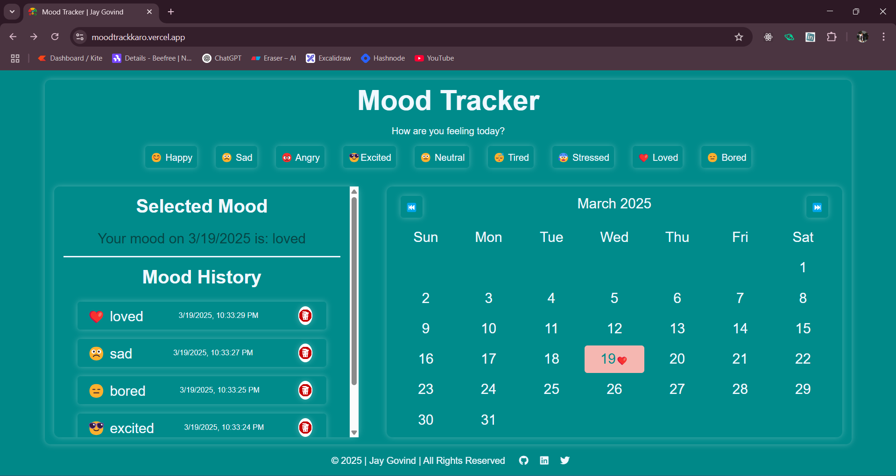

# Mood Tracker

<!-- live demo link-->

**[Live Demo](https://moodtrackkaro.vercel.app/)**

## Overview

The **Mood Tracker** is a web-based application that allows users to log their mood daily using emoji-based selections. The app tracks and visualizes mood trends over time, allowing users to look back at their emotional history and trends.

This app stores mood logs in `LocalStorage`, and displays them in a calendar view with a timeline view of past moods for day, week, and month views. Users can select a mood each day and view the selected mood on the calendar with color-coded backgrounds representing the mood.

## Features

- **📅 Month History** : View mood history for the current month, and day.

- **📊 Emotion Counts** : See how many days you were happy, sad, and so on.

- **📱 Responsive Webpage** : Fully responsive design ensuring smooth access on mobile, tablet, and desktop.

- **🗳️ Local Storage** : Store and retrieve mood history from LocalStorage, ensuring data persistence across sessions.

## Technologies Used

- **[HTML](https://html.com)**: Structure of the web application.
- **[CSS](https://css.com)**: Styling of the mood tracker.
- **[JavaScript](https://javascript.com)**: Functionality for storing moods, updating the calendar, and handling user interactions.
- **[LocalStorage](https://developer.mozilla.org/en-US/docs/Web/API/Window/localStorage)**: To store mood history on the user's browser.
- **[Font Awesome](https://fontawesome.com)**: For social media icons in the footer.
- **[Vercel](https://vercel.com)**: For hosting the web application.

## Getting Started

To get started with the Mood Tracker, follow these steps:

1. Clone the repository to your local machine.

2. Open the `index.html` file in your preferred web browser.
3. Start logging your moods and exploring the mood tracker.

## Contributing

Contributions are welcome! If you have any suggestions, bug reports, or feature requests, please feel free to open an issue or submit a pull request.

## License

This project is licensed under the [MIT License](LICENSE).
